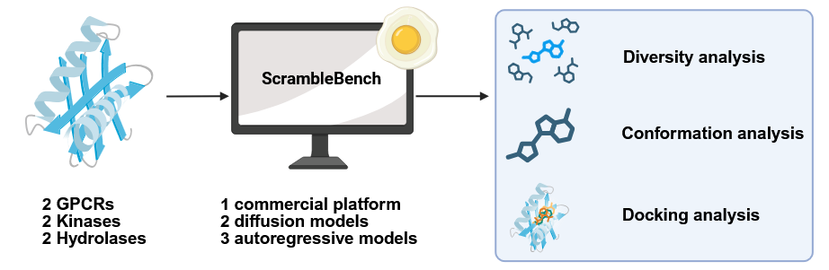

# ScrambleBench v0.0.1

## Introduction


Hi! Welcome to ScrambleBench, A Workflow for Comparative Assessment of Structure-based *de novo* Generative Models. This repository contains the code used for our manuscript. As this version is used for transparency in providing the workflow, it is not currently production-ready and we are currently cleaning the codes. Please look out for our version 0.1.0 soon!

## Table of Contents
- [ScrambleBench v0.0.1](#scramblebench-v001)
  - [Introduction](#introduction)
  - [Table of Contents](#table-of-contents)
  - [Installation](#installation)
  - [Model Repository Installation](#model-repository-installation)
    - [PMDM](#pmdm)
    - [DiffSBDD](#diffsbdd)
    - [Pocket2Mol](#pocket2mol)
    - [PocketFlow](#pocketflow)
    - [Lingo3DMol](#lingo3dmol)
    - [Genbench3D](#genbench3d)
  - [Pre-trained Model Installation](#pre-trained-model-installation)
  - [Usage](#usage)
    - [Main Pipeline](#main-pipeline)
      - [0. Prepare Config File](#0-prepare-config-file)
      - [1. Run Generation](#1-run-generation)
      - [2. Combine SDF files](#2-combine-sdf-files)
      - [3. Preprocess SDF files](#3-preprocess-sdf-files)
      - [4. Combined SDF files](#4-combined-sdf-files)
      - [5. GenBench3D analysis](#5-genbench3d-analysis)
      - [6. Redocking](#6-redocking)
        - [Vina](#vina)
      - [7. Pharmacophore-based screening](#7-pharmacophore-based-screening)
      - [8. Combine Summary](#8-combine-summary)
      - [9. Plotting](#9-plotting)
    - [Diversity Plotting](#diversity-plotting)
    - [Reproducing Figures](#reproducing-figures)
## Installation

```sh
## Install Scramblebench 
conda create -n scramblebench python=3.9
conda activate scramblebench
pip install rdkit numpy matplotlib ptitprince seaborn pandas meeko fastparquet pyarrow
```

## Model Repository Installation

You can write the repository anywhere, but I put mine in the dedicated `models` folder

```bash
cd ScrambleBench
mkdir models
cd models
```

### PMDM

We are not installing the qvina environment for our study.
The mol.yml is changed to included --extra-link-url and --find-links for pytorch
In case torch can not be imported, may need to delete the libcudart.so.11.0 in the torch/lib if libcudart.so.11.8.*.* is also present in the torch/lib.

```bash
git clone https://github.com/Layne-Huang/PMDM
cd PMDM
# change env name to benchmark_pmdm
# add - --extra-index-url https://download.pytorch.org/whl/cu118 at pip
conda env create -f mol.yml
```

### DiffSBDD
```bash
git clone https://github.com/arneschneuing/DiffSBDD
conda env create -f environment.yaml
```

### Pocket2Mol

The config of `sample_for_pdb.yaml` is changed to allow Pocket2Mol to expand its atom

### PocketFlow

```bash
conda create -n benchmark_pocketflow2 python=3.10 pymol-open-source=2.5.0 openbabel -y
pip install torch==1.13.0+cu117 torchvision==0.14.0+cu117 torchaudio==0.13.0 --extra-index-url https://download.pytorch.org/whl/cu117
pip install scipy numpy==1.23.0
pip install pyg_lib torch_scatter torch_sparse torch_cluster torch_spline_conv -f https://data.pyg.org/whl/torch-1.13.0+cu117.html --no-index
pip install rdkit tensorboard six lmdb easydict
pip install torch_geometric==2.3.1
```

### Lingo3DMol

Note: Lingo3DMol/util/pocket_code_all.py was modified to increase pocket representation length from 500 to 1000, probably because the pocket size is too big
```bash
conda create -n lingo3dmol python=3.8
conda activate lingo3dmol
conda install pytorch==1.10.1 torchvision==0.11.2 torchaudio==0.10.1 cudatoolkit=11.3 -c pytorch -c conda-forge
pip install scipy==1.7.3 pandas==1.5.1 numpy==1.20.3 rdkit==2022.09.1 psutil torch_geometric==2.3.1
#maybe add conda install pyg -c pyg if still does not work
```

### Genbench3D
```
git clone https://github.com/bbaillif/genbench3d.git
cd genbench3d
mamba env create -f environment.yml
mamba activate genbench3d
pip install ray
```

Please add this kernel model to the genbench folder

```bash
cp LigBoundConf* [genbench3d root dir]
```
## Pre-trained Model Installation

As I do not own the model, you can download the corresponding model in the respective owner's Github repository:

Pocket2Mol: [pretrained_Pocket2Mol.pt](https://drive.google.com/drive/folders/1KfdOczjUPITPhIvCuBmnj4xFTV-iI2xB)
PocketFlow: [ZINC-pretrained-255000.pt](https://github.com/Saoge123/PocketFlow)
Lingo3DMol: inside Github repository
DiffSBDD: [crossdocked_fullatom_cond.ckpt](https://zenodo.org/record/8183747/files/crossdocked_fullatom_cond.ckpt?download=1)
PMDM: [500.pt](https://zenodo.org/records/10630921)

## Usage

The generation process is entirely dependent on the config file used. You can refer to the example of config file in `run_config` folder for reference.

### Main Pipeline

#### 0. Prepare Config File
```yaml
input:
  complex_path: path to protein-ligand complex 
  pdb_path: path to holo protein pdb
  sdf_path: path to ligand sdf with same coordinate with complex_path

parameter:
  box_size: Pocket2Mol box size
  num_sample: number of ligand to be generated
  name: jobname
  protein_title: protein name

output:
  output_dir: directory of output for generation

models_dir:
  pmdm: root directory of PMDM repository
  diffsbdd: root directory of DiffSBDD repository
  pocket2mol: root directory of Pocket2Mol repository
  pocketflow: root directory of PocketFlow repository
  lingo3dmol: root directory of Lingo3DMol repository

conda_env:
  pmdm: conda name for PMDM
  diffsbdd: conda name for DiffSBDD
  pocket2mol: conda name for Pocket2Mol
  pocketflow: conda name for PocketFlow
  lingo3dmol: conda name for Lingo3DMol
```


```
cd script
python 00_prepare_config_file.py --config_path run_config/config_5HT2C_prepared.yml
```

A config file will be written in the `output/outputdir` folder named `run_generative_ai.yaml`

#### 1. Run Generation

This code will run the generation of the de novo ligand. Please look out for the config of each model to get more information of their parameters, especially their seed. In my experience, Pocket2Mol has the seed number for reproducibility purpose.

```txt
Pocket2Mol:Pocket2Mol/configs/sample_for_pdb.yml
PocketFlow: Unknown
Lingo3DMol: Unknown
DiffSBDD: Unknown
PMDM: Unknown
```

```bash
./01_run_all.sh output_test_multiple_numsample/GPCR_5HT2C_14nov100/run_generative_ai.yaml 
```

#### 2. Combine SDF files

As some models output individuals SDF file for each ligand, we need to combine them. The default output folder in the script is called `summary` folder

```
./02_postprocess_models.sh ../output_test_multiple_numsample/GPCR_5HT2C_14nov100/run_generative_ai.yaml 
```

#### 3. Preprocess SDF files
Now, we clean the SDF file a bit by removing duplicates, validating the structures, and giving name proper unique ID for tagging.

In this command line below, I asked the script to write the outputs in `output_test_multiple_numsample/GPCR_5HT2C_14nov_100/cheminformatics_input_prepared`, subsampling the ligands by taking the last ligands in `Pocket2Mol` and `Lingo3DMol`, while taking random ligands in `Chem42`.

```bash
python ./03_check_count.py -i output_test_multiple_numsample/GPCR_5HT2C_14nov_100/summary \
                           -c output_test_multiple_numsample/GPCR_5HT2C_14nov_100/run_generative_ai.yaml \
                           -o cheminformatics_input_prepared
                           --pick_last Pocket2Mol Lingo3DMol
                           --pick_random Chem42
                           --model_list Pocket2Mol Lingo3DMol Chem42 DiffSBDD PMDM
```

#### 4. Combined SDF files

This script is mainly used for Docking analysis, which will combine all models together that targets the same protein.

Please edit the variable in line 67-71 according to your needs. This will be fixed in v0.1.0

```bash
python ./04_combine_generated_ligand.py
```

#### 5. GenBench3D analysis

This will run the GenBench3D analysis. Please fill in the config files in the GenBench3D repository in `config/default.yaml`. I am using this configuration instead (named `config/GenAI_evaluation.yaml`)

```yaml
benchmark_dirpath: GenBench3D rootdir repository
glide_working_dir: I am not sure about this
pocket_distance_from_ligand: 5.0 # Angstrom

bin:
  prepare_receptor_bin_path: 'yourpath/models/genbench3d/ADFRsuite_x86_64Linux_1.0/bin/prepare_receptor' # https://ccsb.scripps.edu/adfr/downloads/
  glide_path: '/opt/schrodinger2025-4/glide'
  structconvert_path: '/opt/schrodinger2025-4/utilities/structconvert'

data:
  ligboundconf_path: 'yourpath/models/genbench3d/S2_LigBoundConf_minimized.sdf' # https://pubs.acs.org/doi/suppl/10.1021/acs.jcim.0c01197/suppl_file/ci0c01197_si_002.zip

genbench3d:
  minimum_pattern_values: 50
  tfd_threshold: 0.2
  q_value_threshold: 0.001
  steric_clash_safety_ratio: 0.75
  maximum_ring_plane_distance: 0.1 # Angstrom
  consider_hydrogens: False
  include_torsions_in_validity3D: False
  add_minimized_docking_scores: True
  overwrite_results: True

minimization:
  distance_constraint: 1.0 # Angstrom
  n_steps: 1000

vina:
  scoring_function: 'vina'
  size_border: 35 # Angstrom
  n_cpus: 100
  seed: 2023
```

Then, edit the `./05_cheminfo_analysis.sh` according to your needs. Here is the explanation of the variable

```bash
genbench_config # line 14, your genbench/config filepath
genbench_dir # line 15, your genbench rootdir path
cheminformatic_input_dir # line 16, your output dirpath from step 3
cheminformatic_input_dir # line 17, your output dirpath for this script
schrodinger_path_exec # line 20, your schrodinger root dirpath
genai_model_array # line 28, your list of model name
is_complex_forcefield_minimisation # line 31, whether you want genbench3d to perform MMFF98 minimisation for the complex protein-ligand
is_complex_forcefield_unminimisation # line 32, whether you want genbench to skip MMFF98 minimisation for the complex protein-ligand. You can do both minimisatio and unminimisation
is_cancel_protonation_by_obabel_or_adfr # line 33. GenBench can do protonation by obabel or adfr. However, if you already prepared your protein beforehand, you can use it to ask genbench3d not to deprotonate it.
```

```bash
./05_cheminfo_analysis.sh ../output_test_multiple_numsample/GPCR_5HT2C_14nov_100/run_generative_ai.yaml
```


#### 6. Redocking

For docking, we currently do not have a strict pipeline for doing so. We are using both Glide SP and Vina to do docking. Make sure that you are using the combined SDF ligand generated from step 4 to do this.

##### Vina

Please refer to the [Easydock Github](https://github.com/ci-lab-cz/easydock) repository to see how the protocol of their docking. For our case, we used the protonated protein structure prepared from Schrodinger Protein Preparation Workflow. For our ligand, we prepared it using Schrodinger LigPrep. Our general command line is something like this:

```bash
conda activate easydock

#prepare ligand and put it in Docking/ligand_input
easydock -i ../output_test_multiple_numsample/Docking/ligand_input/prepared_na_docking_input_ligand.sdf -o ../output_test_multiple_numsample/Docking/vina_output/gpcr_5ht2c_input_docking_vina.db -c 40 --program vina --config ../output_test_multiple_numsample/Docking/vina_input/easydock_config_5HT2C.yml --sdf
```

If you want to prepare the ligand using open-source model, you can add the `--protonation` parameter.

#### 7. Pharmacophore-based screening

In our manuscript, we did our pharmacophore-based screening using Schrodinger Phase. Unfortunately, we currently do not have an open-source pipeline for this. However, feel free to explore Easydock PLIF option which I might use to integrate this in v0.1

#### 8. Combine Summary

This script will use all results from the previous steps. Please edit line 686-701 according to your neeeds.

```bash
python ./06_generate_summary_refactored.py
```
#### 9. Plotting

This script will use the result from step 8. Please edit line 575-597 according to your needs. Please let me know if you have any issue with this code because this code is the messiest and do a lot of things in very few functions, so refactoring is necessary :(

```bash
python ./07_plot_summary.py
```

### Diversity Plotting

This pipeline outlines the codes for plotting the diversity. Shout out to the original Github and the paper discussing about this

github: https://github.com/HXYfighter/HamDiv
paper: https://jcheminf.biomedcentral.com/articles/10.1186/s13321-024-00883-4

Please edit line 112-120 according to your needs (Will be refactored soon hahaha)

Also use a different conda environment described in the dependency of HamDiv. 

**MOST IMPORTANTLY, USE RDKIT V2025.9.3 OR LATER, BECAUSE THE RASCAL MCES HAS SOME BUGS IN EARLIER VERSIONS**
```bash
cd ScrambleBench/script/diversity
python analyse_tsp.py
```

### Reproducing Figures

The main Figures of the manuscript can be reproduced by using the `07_plot_summary.py` code with the file `output_scramblebench_data_warehouse/data_warehouse.parquet` in the Zenodo file

test