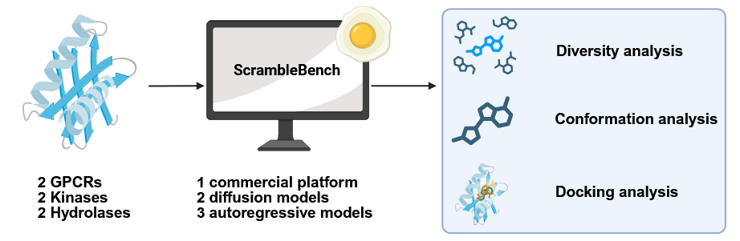

# ScrambleBench v0.1.0

## Introduction


Hi! Welcome to ScrambleBench, A Workflow for Comparative Assessment of Structure-based *de novo* Generative Models. This repository contains the code used for our manuscript. Our v0.1.0 version streamlined most of the features used in our manuscript. Please look out for our version 0.2.0 soon!

## Table of Contents
- [ScrambleBench v0.1.0](#scramblebench-v010)
  - [Introduction](#introduction)
  - [Table of Contents](#table-of-contents)
  - [Installation](#installation)
    - [Method 1: Install through environment.yaml (Recommended)](#method-1-install-through-environmentyaml-recommended)
    - [Method 2: Install manually](#method-2-install-manually)
  - [Model Repository Installation](#model-repository-installation)
    - [PMDM](#pmdm)
    - [DiffSBDD](#diffsbdd)
    - [Pocket2Mol](#pocket2mol)
    - [PocketFlow](#pocketflow)
      - [Automatic (Recommended)](#automatic-recommended)
      - [Manual](#manual)
    - [Lingo3DMol](#lingo3dmol)
      - [Recommended](#recommended)
      - [Manually](#manually)
  - [Other Installation](#other-installation)
    - [Easydock](#easydock)
    - [Genbench3D](#genbench3d)
    - [Diversity](#diversity)
  - [Pre-trained Model Installation](#pre-trained-model-installation)
  - [Usage](#usage)
    - [Examples](#examples)
    - [Step-by step pipeline](#step-by-step-pipeline)
      - [1. Prepare Config File](#1-prepare-config-file)
      - [2. Run Generation](#2-run-generation)
      - [3. Prepare molecule](#3-prepare-molecule)
      - [4a. GenBench3D analysis](#4a-genbench3d-analysis)
      - [4b. Redocking analysis](#4b-redocking-analysis)
      - [4c. Diversity Analysis](#4c-diversity-analysis)
      - [4d. Pharmacophore-based screening](#4d-pharmacophore-based-screening)
      - [5. Compilation of data analysis](#5-compilation-of-data-analysis)
      - [6. Plotting](#6-plotting)
    - [Data Availability](#data-availability)
    - [Reproducing Figures](#reproducing-figures)

## Installation

```sh
git clone https://github.com/Feriolet/ScrambleBench
cd ScrambleBench
```

### Method 1: Install through environment.yaml (Recommended)
```bash
conda env create -f environment.yaml
conda activate scramblebench
pip install -e .
```

### Method 2: Install manually 
```bash
conda create -n scramblebench python=3.10 oddt openbabel
conda activate scramblebench
pip install rdkit numpy matplotlib ptitprince seaborn pandas meeko fastparquet pyarrow uv pytest openmm pdbfixer pyyaml Bio pytest-xdist
pip install -e .
```

## Model Repository Installation

You can write the repository anywhere, but I put mine in the dedicated `models` folder

```bash
mkdir models
cd models
```

### PMDM

We are not installing the qvina environment for our study.
The mol.yml is changed to included --extra-link-url and --find-links for pytorch
In case torch can not be imported, may need to delete the conda/env/pmdm/lib/libcudart.so.11.0 i if libcudart.so.11.8.*.* is also present in the conda/env/pmdm/lib.

```bash
git clone https://github.com/Feriolet/PMDM
cd PMDM
conda env create -f mol.yml

rm /path/to/miniforge/envs/benchmark_pmdm/lib/libcudart.so.11.0
```

### DiffSBDD
```bash
git clone https://github.com/arneschneuing/DiffSBDD
cd DiffSBDD
conda env create -f environment.yaml
mkdir checkpoints
conda activate diffsbdd
pip install "setuptools<11.0"
```

### Pocket2Mol

The config of `sample_for_pdb.yaml` is changed to allow Pocket2Mol to expand its atom
```bash
git clone https://github.com/Feriolet/Pocket2Mol
cd Pocket2Mol
conda env create -f env_cuda113.yml
```

### PocketFlow

#### Automatic (Recommended)
```bash
git clone https://github.com/Feriolet/PocketFlow
cd PocketFlow
conda env create -f environment.yml
```

#### Manual
```bash
conda create -n benchmark_pocketflow python=3.10 pymol-open-source=2.5.0 openbabel -y
conda activate benchmark_pocketflow
pip install torch==1.13.0+cu117 torchvision==0.14.0+cu117 torchaudio==0.13.0 --extra-index-url https://download.pytorch.org/whl/cu117
pip install scipy numpy==1.23.0
pip install pyg_lib torch_scatter torch_sparse torch_cluster torch_spline_conv -f https://data.pyg.org/whl/torch-1.13.0+cu117.html --no-index
pip install rdkit tensorboard six lmdb easydict
pip install torch_geometric==2.3.1
```

### Lingo3DMol

Note: Lingo3DMol/util/pocket_code_all.py was modified to increase pocket representation length from 500 to 1000, probably because the pocket size is too big

#### Recommended
```bash
git clone https://github.com/Feriolet/Lingo3DMol
cd Lingo3DMol
conda env create -f environment.yml
```

#### Manually
```bash
conda create -n lingo3dmol python=3.8
conda activate lingo3dmol
conda install pytorch==1.10.1 torchvision==0.11.2 torchaudio==0.10.1 cudatoolkit=11.3 -c pytorch -c conda-forge
pip install scipy==1.7.3 pandas==1.5.1 numpy==1.20.3 rdkit==2022.09.1 psutil torch_geometric==2.3.1
#maybe add conda install pyg -c pyg if still does not work
```

## Other Installation

### Easydock

```bash
git clone https://github.com/ci-lab-cz/easydock
cd easydock
conda env create -f env.yml -n benchmark_easydock
```

### Genbench3D
```bash
git clone https://github.com/Feriolet/genbench3d.git
cd genbench3d
conda env create -f environment.yml

#also install adfr if you can
```

Please add this kernel model to the genbench folder

```bash

cp LigBoundConf* [genbench3d root dir]
cd [genbench3d root dir]
tar -xvzf LigBoundConf_geometry_kernel_densities.tar.gz
tar -xvzf LigBoundConf_geometry_values.tar.gz
```

### Diversity
```bash
git clone https://github.com/HXYfighter/HamDiv
cd HamDiv
conda create -n python_tsp numpy rdkit tqdm networkx -y
conda activate python_tsp
pip install python_tsp
```

## Pre-trained Model Installation

As I do not own the model, you can download the corresponding model in the respective owner's Github repository:


Pocket2Mol (to `Pocket2Mol/ckpt/`): [pretrained_Pocket2Mol.pt](https://drive.google.com/drive/folders/1KfdOczjUPITPhIvCuBmnj4xFTV-iI2xB)

PocketFlow (to `PocketFlow/ckpt/`): [ZINC-pretrained-255000.pt](https://github.com/Saoge123/PocketFlow)

Lingo3DMol (to `Lingo3DMol/checkpoint/`): [contact.pkl](https://stonewise-lingo3dmol-public.s3.cn-northwest-1.amazonaws.com.cn/contact.pkl) and [gen_mol.pkl](https://stonewise-lingo3dmol-public.s3.cn-northwest-1.amazonaws.com.cn/gen_mol.pkl)

DiffSBDD (to `DiffSBDD/checkpoints`): [crossdocked_fullatom_cond.ckpt](https://zenodo.org/record/8183747/files/crossdocked_fullatom_cond.ckpt?download=1)

PMDM (to `PMDM/`): [500.pt](https://zenodo.org/records/10630921)

## Usage

### Examples

You can access the `example` folder to run multiple kinds of benchmark. We encourage you to use the `example/run_multiple_targets_multiple_parameters` since this is the folder that is most often tested. Alternatively, you can use
`run_simplest_config` for very fast generation and analysis.

```bash
cd example/run_simplest_config
chmod +x ./prepare_config.sh
chmod +x ./run_scramblebench.sh

conda activate scramblebench
./run_scramblebench.sh
```

### Step-by step pipeline

#### 1. Prepare Config File

Before running the molecule generation, it is necessary to understand the appropriate input for ScrambleBench. Several examples are available in the `example` folder. Briefly, the description of the yaml keys are the following:
```yaml
input:
  protein1: # name of the protein (str)
    complex_path: # pdb file (str). Must have protein + ligand inside
    pdb_path: # pdb file (str). 
    sdf_path: # sdf file (str)

input_dir:
  dirpath: # directory path containing the folders of each protein target

model: 
  pmdm: # name of the model (str)
    name: # name of the model (str)
    dir: # path to model dir (str)
    conda_env: # name of conda env (str)

generation:
  input: # path to output yaml file
  output: # path to generation output (default: input/AI_Generation)
  script_pathfile: # path to generation script for custom model (default: src/script/utils/generation_template.sh)
  parameter:
    box_size: # int or list of float/int separated by comma
    num_sample: # int or list of int separated by comma
    name: # job name (str)

post_generation:
  input: # path to output generation
  output: # path to output post generation
  pick_last: # method of picking last ligand if exceed num_sample (model name must exist in the model key)
  pick_random: # method of picking random ligand if exceed num_sample (model name must exist in the model key)

# optional key
analysis: # currently, only support genbench, redocking, and diversity
  genbench3d:
    input: # input folder (must exist)
    output: # output folder
    genbench_dir: # path to genbench rootdir
    conda_env: #genbench conda environment
    schrodinger_dir: # (optional) schrodinger root directory
    genbench_config: #path to genbench running config (refer to genbench github, we have default config file)
    do_complex_forcefield_minimisation: # (optional) whether to do MMFF98 minimisation before running analysis
    do_docking_forcefield_minimisation: # (optional) whether to do mininplace docking
    skip_genbench3d_protonation: # (optional) whether to ask genbench not to protoonate any input

  redocking: # currently, on support protonation and docking
    protonation: 
      method: # only supported protonation of easydock
      input: # input folder (must exist)
      output: # output folder
      env: # easydock environment

    docking: # currently, only support easydock and glide
      easydock:
        input: # folder must exist in previous pipeline
        output: # output folder
        conda_env: # easydock environment
        protein_preparation: # adfr, obabel, or schrodinger protwizard
        docking_program: # supported docking in easydock, refer to easydock github
        protonation: # only supported protonation of easydock
        config_fname: # easydock config file

      glide:
        input: # input folder, mut exist in previous pipeline
        output: # output folder
        schrodinger_dir: # schrodinger root dir
        reward_intra_hbonds: # whether to reward intramolecular hydrogen bond (bool)
        protonation: # ligprep or none
        protein_preparation: # protwizard or none
  # to be supported in future release
  plif:
    method: schrodinger2025
    input:

  diversity:
    input: # input folder (must exist in previous pipeline)
    output: # output folder
    conda_env: # conda environment for diversity metric
    method: # support multiple distance and diversity in the hamdiv github
    - distance: ecfp
      diversity: hamdiv
    - distance: mces
      diversity: hamdiv
    - distance: null
      diversity: generic_bm

# to be supported in future release
report:
  2d: True
```
In the config file, the input key should be either `input` or `input_dir`. Config file with `input_dir` key must be run with `--dirpath_input` argument in the `p1_generate_config.py` script, which can be seen in the `example/run_multiple_targets_single_dir` folder. 

```txt
usage: p1_generate_config.py [-h] [-i INPUT] [-o OUTPUT] [--dirpath_input]

Prepare config file for ScrambleBench

options:
  -h, --help            show this help message and exit
  -i INPUT, --input INPUT
                        config yaml input file
  -o OUTPUT, --output OUTPUT
                        config yaml output file prefix (i.e., not path directory)
  --dirpath_input       write input key as a single directory
```
Multiple values for the input protein names and parameters (i.e., box_size and num_sample) are supported, which can be seen in the `example` folder.

Currently, all protein target should have a 1) complex pdb, 2) protein pdb, and 3) ligand sdf, because different AI models require different inputs. If you use `input_dir` key, there **MUST** be a **SINGLE** file of protein.pdb, complex.pdb, and ligand.sdf with the string 'protein', 'complex', and 'ligand', respectively, so that the script can detect which one is which. For example, the script will detect 'gpcr_ligand.sdf' as ligand file, but not 'gpcr.sdf', because there is no 'ligand' string in the file.

The path directory should be the following:

```txt
input_folder
├── protein_1
│   ├── complex.pdb
│   ├── protein.pdb
│   └── ligand.sdf
└── protein_2
    ├── complex.pdb
    ├── protein.pdb
    └── ligand.sdf
```

In the future, we will support complex pdb only, but the file directory should still be the same (i.e., individual protein target has its own folder).

A config file and txt file containing a list of the config.yaml will be written in the folder list in value for `config[generation][input]` key.

For best practice, please write the absolute pathdir, as relative pathdir is relative to the executable path (i.e., pwd). Despite this, relative pathdir is still allowed, and ScrambleBench will resolve it in the config output.


#### 2. Run Generation

```yaml
#yaml config
generation:
  input: # path to output yaml file
  output: # path to generation output (default: input/AI_Generation)
  script_pathfile: # path to generation script for custom model (default: src/script/utils/generation_template.sh)
  parameter:
    box_size: # int or list of float/int separated by comma
    num_sample: # int or list of int separated by comma
    name: # job name (str)
```
The generation script allows two kinds of input: a single yaml file input or a txt file containing a list of yaml pathdir. 

Before generation, this script will check whether the generation script (default: `src/script/utils/generation_template.sh`) will generate molecules by the correct AI model by their conda environment (e.g., pmdm model should have a `$model_pmdm_conda_env` and pocket2mol model should have a `$model_pocket2mol_conda_env` string in the bash script).

```txt
usage: p2_execute_generation.py [-h] -i INPUT

Run de novo molecule generation after p1_generate_config.py

options:
  -h, --help            show this help message and exit
  -i INPUT, --input INPUT
                        config yaml input file or txt file containing yaml filepath
```

Expected output:
```
output_folder
├── model1
│   └── generated_model1_ligand.sdf
└── model2
│   └── generated_model2_ligand.sdf
└── summary
    ├── generated_model1_ligand.sdf
    └── generated_model2_ligand.sdf   
```
#### 3. Prepare molecule

After generation, the molecules need to be prepared and validated.

The input **MUST** contains the `summary` folder with an `.sdf` file containing all generated ligands and named with the model name, as seen in the previous step.

Expected input:
```
summary
  ├── generated_model1_ligand.sdf
  └── generated_model2_ligand.sdf  
```
```yaml
#yaml config
post_generation:
  input: # path to output generation
  output: # path to output post generation
  pick_last: # method of picking last ligand if exceed num_sample (model name must exist in the model key)
  pick_random: # method of picking random ligand if exceed num_sample (model name must exist in the model key)
```

The key `pick_last` and `pick_random` should be filled with the model name (case sensitive). This will only trigger when the model generate more ligand than the requested `num_sample`. For example, if the requested num_sample is `100`, but the model has generated `200` ligand, the script will trim it down to `100` ligands instead. `pick_last` will pick the last `100` ligands from the `.sdf` file, while `pick_random` will randomly pick ligands. If the model is unspecified, the script will use `pick_random` by default.


```txt
usage: p3_prepare_molecule.py [-h] -i INPUT

Prepare generated molecules for downstream analysis

options:
  -h, --help            show this help message and exit
  -i INPUT, --input INPUT
                        config yaml input file or txt file containing yaml filepath
```

Expected_output:
```
output_folder
├── model1
│   └── prepared_model1_ligand.sdf
└── model2
    └── prepared_model2_ligand.sdf
```
#### 4a. GenBench3D analysis

This will run the GenBench3D analysis. Please fill in the config files in the GenBench3D repository in `config/GenAI_evaluation.yaml`. An example is also shown in the `example/run_multiple_targets_multiple_parameters/config/GenAI_evaluation.yaml`.

Expected input:
```
input_folder
├── model1
│   └── prepared_model1_ligand.sdf
└── model2
    └── prepared_model2_ligand.sdf 
```

Scramblebench script currently does not attempt to access genbench3d config, which is why there is a duplicate keys in both the `ScrambleBench` and `GenBench3D` configs (e.g., `schrodinger_dir`).

```yaml
# ScrambleBench config
analysis: # currently, only support genbench, redocking, and diversity
  genbench3d:
    input: # input folder (must exist)
    output: # output folder
    genbench_dir: # path to genbench rootdir
    conda_env: #genbench conda environment
    schrodinger_dir: # (optional) schrodinger root directory
    genbench_config: #path to genbench running config (refer to genbench github, we have default config file)
    do_complex_forcefield_minimisation: # (optional) whether to do MMFF98 minimisation before running analysis
    do_docking_forcefield_minimisation: # (optional) whether to do mininplace docking
    skip_genbench3d_protonation: # (optional) whether to ask genbench not to protoonate any input
```
```yaml
# genbench3d config
benchmark_dirpath: GenBench3D rootdir repository
glide_working_dir: I am not sure about this
pocket_distance_from_ligand: 5.0 # Angstrom

bin:
  prepare_receptor_bin_path: 'yourpath/models/genbench3d/ADFRsuite_x86_64Linux_1.0/bin/prepare_receptor' # https://ccsb.scripps.edu/adfr/downloads/
  glide_path: '/opt/schrodinger2025-4/glide'
  structconvert_path: '/opt/schrodinger2025-4/utilities/structconvert'

data:
  ligboundconf_path: 'yourpath/models/genbench3d/S2_LigBoundConf_minimized.sdf' # https://pubs.acs.org/doi/suppl/10.1021/acs.jcim.0c01197/suppl_file/ci0c01197_si_002.zip

genbench3d:
  minimum_pattern_values: 50
  tfd_threshold: 0.2
  q_value_threshold: 0.001
  steric_clash_safety_ratio: 0.75
  maximum_ring_plane_distance: 0.1 # Angstrom
  consider_hydrogens: False
  include_torsions_in_validity3D: False
  add_minimized_docking_scores: True
  overwrite_results: True

minimization:
  distance_constraint: 1.0 # Angstrom
  n_steps: 1000

vina:
  scoring_function: 'vina'
  size_border: 35 # Angstrom
  n_cpus: 100
  seed: 2023
```

```txt
usage: p4_analyse_genbench3d.py [-h] -i INPUT

Perform genbench3d analysis after molecule preparation

options:
  -h, --help            show this help message and exit
  -i INPUT, --input INPUT
                        config yaml input file or txt file containing yaml filepath
```

Because genbench3d allows for many different parameter choices, each analysis can take a long time. Below is some of the parameter that can be used:
| Parameter | Description | Config Key| Default |
| -------- | ----------------------- | -------- | ------- |
| Complex Minimisation  | Whether to do MMFF94 minimisation before analysis  | `do_complex_forcefield_minimisation` | False (setting True will perform both analysis)
| Docking Minimisation | Whether to do mininplace scoring | `do_docking_forcefield_minimisation` | False (setting True will perform both analysis)
| Docking Program | Which docking program to use | varied (`--schrodinger_dir` to do Glide SP) | Vina (unless input key in `ScrambleBench` config is missing; see `examples/run_without_protein_input`)

In order to track GenBench3D analysis, we have set up a `genbench3d_checkpoint.json` to prevent repeat analysis in case analysis terminated halfway.

Expected_output:
```
output_folder
├── structural_input
│   ├── protein.pdb (from input)
│   ├── ligand.sdf (from input)
│   ├── protein.pdbqt (for vina)
│   ├── protein_grid.txt (for glide)
│   └── other intermediates files
├── json_output
│   ├── prepared_model1_ligand_minimisation.json
│   ├── prepared_model1_ligand_minimisation.log
│   ├── prepared_model2_ligand_minimisation.json
│   └── prepared_model2_ligand_minimisation.log
├── Vina
├── Glide
└── genbench3d_checkpoint.json # checks if analysis is done per model per minimisation 
```

Sample of `genbench3d_checkpoint.json`:
```json
{
    "Pocket2Mol": {
        "unminimised": "COMPLETED",
        "minimised": "FAILED"
    },
    "DiffSBDD": {
        "unminimised": "FAILED",
        "minimised": "PENDING"
    }
}
```
#### 4b. Redocking analysis

For redocking, we currently support `easydock` redocking and `Glide SP` redocking. However, to run easydock, it is necessary to have some knowledge of how to run easydock to edit our configuration (mainly the easydock config and grid file). For now, my script supports vina by default, but will be able to support other docking program supported by easydock in the future. However, this is not tested yet!

Separate installation is needed to run these programs. Please refer to the easydock documentation here: [protonation](https://easydock.readthedocs.io/en/latest/usage/#protonation-options) and [docking](https://easydock.readthedocs.io/en/latest/usage/#molecular-docking)

supported easydock docking program: `vina`, `gnina`, `smina`, `vina-gpu`, `qvina`, `server`

supported easydock protonation program: `molgpka`, `unipka`, `chemaxon`

Expected input:
```
input_folder
├── model1
│   └── prepared_model1_ligand.sdf
└── model2
    └── prepared_model2_ligand.sdf 
```

```yaml
analysis:
  redocking: # currently, on support protonation and docking
    protonation: 
      method: # only supported protonation of easydock
      input: # input folder (must exist)
      output: # output folder
      env: # easydock environment

    docking: # currently, only support easydock and glide
      easydock:
        input: # folder must exist in previous pipeline
        output: # output folder
        conda_env: # easydock conda environment
        protein_preparation: # adfr, obabel, or protwizard
        docking_program: # supported docking in easydock, refer to easydock github
        protonation: # only supported protonation of easydock
        config_fname: # easydock config file

      glide:
        input: # input folder, mut exist in previous pipeline
        output: # output folder
        schrodinger_dir: # schrodinger root dir
        reward_intra_hbonds: # whether to reward intramolecular hydrogen bond (bool)
        protonation: # ligprep or none
        protein_preparation: # protwizard or none
```

Note that there is two levels of protonation here: `protonation` key and within the `docking` key. This is provided in case that users want to protonate their molecules outside of `easydock` (e.g., `LigPrep`). However, since `easydock` can only take unique molecules, `ScrambleBench` does not support molecule inputs with multiple protonation/isomer. This will be supported in v0.2.0 or later.


```txt
usage: p4_analyse_redocking.py [-h] -i INPUT

Redocking analysis after molecule preparation

options:
  -h, --help            show this help message and exit
  -i INPUT, --input INPUT
                        config yaml input file or txt file containing yaml filepath
```

Expected output (identical structure for `protonation`, `easydock`, and `glide` redocking):
```
output_folder
├── model1
│   └── docked_model1_ligand.sdf
└── model2
    └── docked_model2_ligand.sdf 
```

#### 4c. Diversity Analysis

This pipeline outlines the codes for plotting the diversity. Shout out to the original Github and the paper discussing about this

github: https://github.com/HXYfighter/HamDiv
paper: https://jcheminf.biomedcentral.com/articles/10.1186/s13321-024-00883-4

**MOST IMPORTANTLY, USE RDKIT V2025.9.3 OR LATER, BECAUSE THE RASCAL MCES HAS SOME BUGS IN EARLIER VERSIONS**

```yaml
analysis:
  diversity:
    input: # input folder (must exist in previous pipeline)
    output: # output folder
    conda_env: # conda environment for diversity metric
    method: # support multiple distance and diversity in the hamdiv github
    - distance: ecfp
      diversity: hamdiv
    - distance: mces
      diversity: hamdiv
    - distance: null
      diversity: generic_bm
```
Supported `distance` and `diversity` combination (please refer to HamDiv paper for definition for the distance)

| distance | diversity |
| ---------| ----------|
| ecfp | hamdiv | 
| mces | hamdiv |
| ecfp | average |
| null | richness |
| null | rs |
| null| fg|
| null | bm |
| null | generic_bm|
| null | intdiv|
| null | sumdiv|
| null | diam|
| null | sumdiam|
| null | sumbot|
| null | bot|
| null | dpp|

```
usage: p4_analyse_diversity.py [-h] -i INPUT

Calculate Diversity of generated compound

options:
  -h, --help            show this help message and exit
  -i INPUT, --input INPUT
                        config yaml input file or txt file containing yaml filepath
```

Expected output:
```
output_folder
├── model1
│   └── diversity_output.json
└── model2
    └── diversity_output.json 
```

#### 4d. Pharmacophore-based screening

In our manuscript, we did our pharmacophore-based screening using Schrödinger Phase. Unfortunately, we currently do not have an open-source pipeline for this. However, feel free to explore Easydock PLIF option which I might use to integrate this in v0.1

#### 5. Compilation of data analysis

After performing the data analysis, we can collect all of the information into one single `.csv` file.

The script will detect whether each data analysis key exists in the `ScrambleBench` config file (i.e., `genbench3d`, `diversity`, `redocking`)
```
usage: p5_collect_data_analysis.py [-h] -i INPUT

Collect data of analysis done in p4_analyse.py

options:
  -h, --help            show this help message and exit
  -i INPUT, --input INPUT
                        config yaml input file or txt file containing yaml filepath
```

Expected output:
```
folder
├── yaml_list.txt # from step 1
├── protein1 folder
└── all.csv # output
```

#### 6. Plotting

To be supported in future release.


### Data Availability
Please install the files in our [Zenodo](https://zenodo.org/records/18503149) for reproducibility.

### Reproducing Figures

Please refer to the `v0.0.1` for the codes to reproduce the figure.

The main Figures of the manuscript can be reproduced by using the `07_plot_summary.py` code with the file `output_scramblebench_data_warehouse/data_warehouse.parquet` in the Zenodo file
